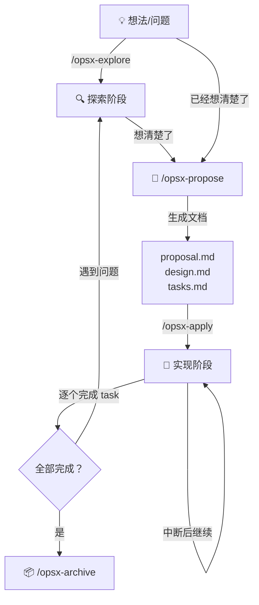

# Antigravity 高效使用完全指南

> **Antigravity** 是 Google DeepMind 团队开发的 AI 编码 Agent，嵌入 IDE 中运行。它不是普通的聊天机器人，而是一个能直接操作文件、运行命令、搜索代码、操控浏览器的**全能编程搭档**。

---

## 目录

1. [核心理念：从"问答"到"协作"](#一核心理念)
2. [12 大核心工具详解](#二12-大核心工具详解)
3. [上下文感知系统](#三上下文感知系统)
4. [Skills 技能系统](#四skills-技能系统)
5. [OpenSpec 结构化变更管理](#五openspec-结构化变更管理)
6. [Workflows 自定义工作流](#六workflows-自定义工作流)
7. [Artifact 文档系统](#七artifact-文档系统)
8. [MCP 服务集成](#八mcp-服务集成)
9. [用户规则配置](#九用户规则配置)
10. [安全机制](#十安全机制)
11. [高效沟通模式](#十一高效沟通模式)
12. [高级技巧与 Pro Tips](#十二高级技巧与-pro-tips)
13. [常见问题](#十三常见问题)

---

## 一、核心理念

```
┌──────────────────────────────────────────────────────────────────┐
│                      思维模式转换                                │
│                                                                  │
│   ❌ 旧模式：你是执行者                                          │
│      你问 AI "怎么做" → AI 回复文字 → 你手动复制粘贴执行         │
│                                                                  │
│   ✅ 新模式：你是决策者                                          │
│      你说"做什么" → AI 自动分析 + 执行 + 验证 → 你审核结果        │
│                                                                  │
└──────────────────────────────────────────────────────────────────┘
```

**关键转变**：
- 你不需要复制粘贴代码
- 你不需要教 AI 怎么操作
- 你只需要描述**目标**，AI 负责**路径**

---

## 二、12 大核心工具详解

### 1. 文件读写 (`view_file` / `write_to_file` / `replace_file_content`)

AI 可以直接查看和修改你硬盘上的任何文件。

```text
# 读取文件
你说：「看看 application.yml 的数据库配置」
AI → 直接读取文件内容 → 分析 → 给出建议

# 修改文件（精确替换，不会动其他代码）
你说：「把连接池大小从 10 改成 50」
AI → 定位到精确的代码行 → 只替换那一行 → 完成

# 创建新文件
你说：「创建一个 UserService.java」
AI → 创建文件 + 写入完整代码 → 完成
```

> [!TIP]
> **最小改动原则**：AI 修改文件时只替换必要的行，不会删除整段代码重新插入。你可以在 IDE 的 diff 视图中查看每次修改。

---

### 2. 终端命令 (`run_command`)

AI 可以直接在你的电脑上执行命令。

```text
# 构建项目
你说：「Maven 打包一下」
AI → 执行 mvn clean package → 监控输出 → 如果报错自动分析修复

# 查看端口
你说：「8080 端口被谁占了」
AI → 执行 netstat → 解析结果 → 告诉你进程信息

# Git 操作
你说：「提交代码，message 写"修复登录异常"」
AI → git add -A → git commit -m "修复登录异常" → 完成

# Docker 操作
你说：「启动 docker-compose」
AI → docker-compose up -d → 检查容器状态 → 报告结果
```

**命令安全分级**：

| 级别 | 命令类型 | 行为 |
|---|---|---|
| 🟢 自动执行 | git, npm, mvn, docker, curl, node, python, cat, ls, grep 等 | 直接运行，无需确认 |
| 🟡 需要确认 | 安装依赖、修改配置等 | 弹出确认框 |
| 🔴 强制确认 | rm -rf, 修改系统文件、注册表 | 必须用户批准 |

---

### 3. 代码搜索 (`grep_search` / `find_by_name`)

```text
# 全文搜索
你说：「找出所有用到 @Deprecated 的地方」
AI → 使用 ripgrep 搜索整个项目 → 返回文件名 + 行号 + 代码内容

# 文件搜索
你说：「找出所有 Controller 文件」
AI → 搜索 *Controller.java → 列出所有匹配文件

# 正则搜索
你说：「找出所有 hardcoded 的 IP 地址」
AI → 正则匹配 \d+\.\d+\.\d+\.\d+ → 列出结果
```

---

### 4. Web 搜索 (`search_web`)

AI 可以实时搜索互联网获取最新信息。

```text
你说：「Spring AI 1.0 有什么新特性」
AI → 搜索互联网 → 汇总最新文档 → 给出答案 + 链接

你说：「查一下这个报错怎么修：ClassNotFoundException: xxx」
AI → 搜索 StackOverflow/GitHub Issues → 找到解决方案 → 直接帮你修
```

---

### 5. 网页抓取 (`read_url_content`)

直接读取网页内容，比 Web 搜索更精确。

```text
你说：「看看这个文档说了什么：https://docs.spring.io/xxx」
AI → 抓取网页 → 转成 Markdown → 提取关键信息

你说：「读一下这个 GitHub Issue」
AI → 抓取 Issue 内容 → 分析问题 → 给出建议
```

---

### 6. 浏览器操控 (`browser_subagent`)

AI 可以启动浏览器、打开页面、点击按钮、截图。

```text
你说：「打开 localhost:8080 看看页面显示正常不」
AI → 打开浏览器 → 截图页面 → 报告问题

你说：「测试一下登录功能」
AI → 打开登录页 → 输入账号密码 → 点击登录 → 检查结果

你说：「截图首页给我看看效果」
AI → 截图 → 保存 → 展示缩略图
```

> [!NOTE]
> 所有浏览器操作会自动录制为 WebP 视频，保存在 `browser_recordings/` 目录。

---

### 7. 图片生成 (`generate_image`)

```text
你说：「给首页 hero section 生成一张科技感背景图」
AI → 生成图片 → 保存到 Artifact 目录 → 可直接在项目中引用

你说：「生成一个产品 Logo 草图」
AI → 生成 → 你确认 → 使用
```

---

### 8. 目录浏览 (`list_dir`)

```text
你说：「看看项目结构」
AI → 列出所有文件和目录 → 显示大小、层级关系
```

---

### 9. MCP 资源访问 (`list_resources` / `read_resource`)

可以连接外部 MCP 服务器获取数据（需配置）。

---

### 10. 终端交互 (`send_command_input` / `read_terminal`)

对于长时间运行或交互式命令，AI 可以发送输入、读取输出。

```text
# 交互式命令
你说：「启动 Maven 项目，如果提示选择版本就选 3.2.0」
AI → 运行命令 → 监控输出 → 在提示时自动输入 → 完成
```

---

### 11. 文档内容查看 (`view_content_chunk`)

对于大型网页文档，可以分块查看。

---

### 12. 命令状态监控 (`command_status`)

后台运行的命令可以实时监控进度和输出。

---

## 三、上下文感知系统

这是 Antigravity 最独特的能力之一——它**实时感知你的工作状态**：

```
┌───────────────────────────────────────────────────────┐
│              AI 实时感知的信息                          │
├───────────────────────────────────────────────────────┤
│                                                       │
│  📄 当前活动文件                                      │
│     你打开了 ChatController.java                      │
│                                                       │
│  📍 光标位置                                          │
│     光标在第 45 行                                    │
│                                                       │
│  📂 所有打开的文件标签页                               │
│     application.yml, pom.xml, index.html...           │
│                                                       │
│  💻 正在运行的终端命令                                 │
│     mvn clean package (已运行 30s)                    │
│                                                       │
│  🌐 浏览器状态                                        │
│     打开了 localhost:8080，Viewport 1920x1080         │
│                                                       │
│  🕐 当前时间                                          │
│     2026-04-07T12:37:24+08:00                        │
│                                                       │
│  💻 操作系统                                          │
│     Windows                                           │
│                                                       │
└───────────────────────────────────────────────────────┘
```

**这意味着什么？**

```text
# 你不需要告诉 AI 你在看哪个文件
你打开了 pom.xml，然后说：「这里的版本号对吗？」
AI 知道你在问 pom.xml 中的依赖版本

# 你不需要复制粘贴报错信息
终端显示了 Maven 编译错误，你说：「报错了帮我看看」
AI 自动读取终端输出 → 分析错误 → 修复代码
```

---

## 四、Skills 技能系统

### 什么是 Skills？

Skills 是**预装的专业能力包**，让 AI 在特定领域表现得更专业。

### 触发机制：完全自动

> [!IMPORTANT]
> **你不需要手动调用 Skills！** AI 根据你的请求内容自动判断是否需要加载对应 Skill。

### 已安装的 17 个 Skills

#### 🎨 设计与创意类

| Skill | 触发场景 | 核心能力 |
|---|---|---|
| **frontend-design** | 构建网页/Dashboard/UI | 生成专业级前端代码，拒绝 AI 模板化审美 |
| **canvas-design** | 制作海报/设计图 | 生成 PNG/PDF 格式的视觉作品 |
| **algorithmic-art** | 生成算法艺术 | 使用 p5.js 创建生成式艺术 |
| **theme-factory** | 应用主题样式 | 10 种预设主题 + 自定义主题 |
| **brand-guidelines** | 应用品牌规范 | 统一的色彩/字体体系 |

#### 📄 文档与文件类

| Skill | 触发场景 | 核心能力 |
|---|---|---|
| **pdf** | 任何 PDF 操作 | 读取/合并/拆分/水印/OCR/加密 |
| **docx** | Word 文档操作 | 创建/编辑带目录/页码的专业文档 |
| **xlsx** | Excel/CSV 操作 | 创建/编辑/清洗/图表化 |
| **pptx** | PPT 操作 | 制作/修改/提取 Slide 内容 |
| **doc-coauthoring** | 撰写文档/提案/技术规范 | 三阶段共创流程：收集→优化→验证 |

#### 🛠 开发与构建类

| Skill | 触发场景 | 核心能力 |
|---|---|---|
| **webapp-testing** | 测试 Web 应用 | Playwright 自动化测试 + 截图 |
| **claude-api** | 使用 Claude API 开发 | 构建 Claude/Anthropic SDK 应用 |
| **mcp-builder** | 构建 MCP Server | 创建 Model Context Protocol 服务器 |
| **web-artifacts-builder** | 构建复杂 Web 组件 | React + Tailwind + shadcn/ui |
| **skill-creator** | 创建/优化 Skill | 开发 + 测试 + 迭代自定义 Skill |

#### 📝 沟通与其他

| Skill | 触发场景 | 核心能力 |
|---|---|---|
| **internal-comms** | 写内部沟通文档 | 状态报告/项目更新/事故报告 |
| **slack-gif-creator** | 制作 Slack 动图 | 创建适配 Slack 的 GIF |

### Skills 使用示例

```text
# 场景 1：做前端页面
你说：「设计一个智能客服系统的管理 Dashboard」
→ 自动触发 frontend-design
→ 选择独特的设计风格（不是千篇一律的模板）
→ 生成完整的 HTML/CSS/JS 代码

# 场景 2：处理文件
你说：「把这 5 个 PDF 合并成一个，加上页码」
→ 自动触发 pdf skill
→ 安装依赖 → 合并 → 加页码 → 保存

# 场景 3：写文档（三阶段共创）
你说：「帮我写一个技术设计文档」
→ 自动触发 doc-coauthoring
→ Stage 1：问你 5-10 个问题收集上下文
→ Stage 2：逐章节头脑风暴 → 你选择 → AI 起草 → 迭代修改
→ Stage 3：新 AI 实例测试文档是否有盲区
```

### 创建自定义 Skill

```text
你说：「帮我创建一个 Spring Boot 脚手架生成器 Skill」
→ 触发 skill-creator
→ 引导你定义 Skill 做什么
→ 编写 SKILL.md
→ 创建测试用例
→ 运行测试 → 评估 → 迭代优化
→ 最终打包
```

Skill 文件结构：
```
my-skill/
├── SKILL.md          # 主指令文件（必须）
├── scripts/          # 辅助脚本（可选）
├── references/       # 参考文档（可选）
└── assets/           # 资源文件（可选）
```

---

## 五、OpenSpec 结构化变更管理

### 什么是 OpenSpec？

当你要做一个**多步骤的功能开发或重构**时，OpenSpec 帮你把模糊的想法变成：**提案 → 设计 → 任务清单 → 逐步实现 → 归档**。

### 工作流程图



### 四个核心命令

#### `/opsx-explore` — 探索模式（思考阶段）

```text
你说：/opsx-explore
     我在考虑给客服系统加知识库管理功能

AI 行为：
├── 分析现有代码架构
├── 画 ASCII 架构图
├── 对比多种技术方案（RAG vs 关键词 vs 混合）
├── 提出关键问题帮你思考
└── 🚫 绝对不会写代码（这是思考时间！）
```

#### `/opsx-propose` — 提案模式（规划阶段）

```text
你说：/opsx-propose
     add-knowledge-base：支持文档上传、自动向量化、语义检索

AI 行为：
├── 创建 openspec/changes/add-knowledge-base/
├── 生成 proposal.md（做什么 & 为什么）
├── 生成 design.md（怎么做）
├── 生成 tasks.md（具体步骤 + checkbox）
└── 提示 "Ready for implementation"
```

#### `/opsx-apply` — 实现模式（编码阶段）

```text
你说：/opsx-apply

AI 行为：
├── 读取 proposal/design/tasks 获取上下文
├── Working on task 1/5: 创建知识库数据模型 ✓
├── Working on task 2/5: 实现文档上传 API ✓
├── Working on task 3/5: 集成向量数据库 ← 当前
├── ...
└── 每完成一个 task 自动勾选 checkbox
```

> [!TIP]
> 可以随时中断，下次用 `/opsx-apply` 继续，AI 会恢复进度。

#### `/opsx-archive` — 归档模式（收尾阶段）

```text
你说：/opsx-archive

AI 行为：
├── 检查所有 task 是否完成
├── 检查 artifact 完成状态
├── 移动到 openspec/changes/archive/2026-04-07-add-knowledge-base/
└── 显示归档摘要
```

### OpenSpec CLI 命令

```bash
openspec --version          # 查看版本（当前 1.2.0）
openspec list --json        # 列出所有变更
openspec new change "name"  # 创建新变更
openspec status --change "name" --json  # 查看状态
```

---

## 六、Workflows 自定义工作流

### 什么是 Workflow？

Workflow 是你定义的**可重复执行的标准化流程**，保存为 Markdown 文件。

### 文件位置

```
项目级 Workflow：d:\code\agent\.agent\workflows\
全局 Workflow ：C:\Users\Administrator\.gemini\antigravity\global_workflows\
```

### 创建 Workflow

```text
你说：「帮我创建一个部署到生产环境的 workflow」
AI 会创建 .agent/workflows/deploy-production.md
```

Workflow 文件格式：
```markdown
---
description: 部署应用到生产环境
---
1. 执行单元测试：`mvn test`
2. 构建项目：`mvn clean package -DskipTests`
// turbo
3. 构建 Docker 镜像：`docker build -t my-agent .`
4. 推送到镜像仓库
5. 更新 Kubernetes 部署
```

### 特殊注解

| 注解 | 作用 |
|---|---|
| `// turbo` | 该步骤自动执行，无需确认 |
| `// turbo-all` | 整个 Workflow 所有步骤都自动执行 |

### 调用 Workflow

```text
/deploy-production     ← 对应 workflows/deploy-production.md
/opsx-propose          ← 对应 workflows/opsx-propose.md
```

---

## 七、Artifact 文档系统

### 什么是 Artifact？

Artifact 是 AI 创建的**持久化结构化文档**，支持丰富的格式。

### 存储位置

```
会话级 Artifact：C:\Users\Administrator\.gemini\antigravity\brain\{conversation-id}\
```

> **建议**：重要的 Artifact 让 AI 复制到项目的 `docs/` 目录下，方便在 IDE 中随时查看。

### Artifact 支持的格式

| 格式 | 用途 | 语法 |
|---|---|---|
| Markdown 表格 | 结构化数据展示 | 标准 Markdown 表格语法 |
| Mermaid 图表 | 流程图/架构图/时序图 | ` ```mermaid ` |
| 代码块 | 代码展示 + 语法高亮 | ` ```java ` |
| Diff 块 | 显示代码变更 | ` ```diff ` |
| Alert 提示框 | 重要信息高亮 | `> [!NOTE]` / `> [!WARNING]` 等 |
| 文件链接 | 链接到本地文件 | `[文件名](file:///path)` |
| 图片/视频嵌入 | 嵌入媒体 | `` |
| Carousel 轮播 | 多内容顺序展示 | ` ````carousel ` |

### 创建 Artifact

```text
你说：「帮我生成一份代码审查报告」
AI → 创建 Artifact 文档 → 包含表格/代码/建议 → 保存

你说：「把这个报告放到 docs 目录」
AI → 复制到 d:\code\agent\docs\ → 你可以在 IDE 中打开
```

---

## 八、MCP 服务集成

### 什么是 MCP？

MCP (Model Context Protocol) 是让 AI 连接外部服务的标准协议。

### 配置文件

```
C:\Users\Administrator\.gemini\antigravity\mcp_config.json
```

### 可以连接的服务示例

- 数据库（MySQL、PostgreSQL、MongoDB）
- API 服务（GitHub、Jira、Slack）
- 文件系统
- 自定义 MCP Server

### 创建 MCP Server

```text
你说：「帮我创建一个连接公司 MySQL 数据库的 MCP Server」
→ 自动触发 mcp-builder skill
→ 引导你选择语言（推荐 TypeScript）
→ 生成完整的 MCP Server 代码
→ 测试 → 配置到 mcp_config.json
```

---

## 九、用户规则配置

### 什么是用户规则？

用户规则是你对 AI 行为的**全局约束**，AI 必须无条件遵守。

### 你当前的规则摘要

你已配置了一套**中文架构师协议 V4.0**：

| 规则 | 内容 |
|---|---|
| 语言规则 | 始终使用中文回复，代码注释全中文 |
| 思维链规则 | 思维过程必须使用中文，禁止完整英文句子 |
| 代码编辑规则 | 使用最小改动原则，禁止 sed/awk |
| 回复风格 | 简洁直接，先方案后原因 |
| 终端命令策略 | 白名单命令自动执行，危险命令需确认 |

### 如何修改规则

用户规则通常配置在 IDE 设置中。你可以要求 AI 帮你修改或新增规则。

---

## 十、安全机制

### 三层安全保障

```
┌─────────────────────────────────────────────────────────┐
│  第 1 层：命令分级                                       │
│  ├── 🟢 白名单命令 → 自动执行                           │
│  ├── 🟡 普通命令 → 弹出确认                             │
│  └── 🔴 危险命令 → 强制确认 + 警告                      │
├─────────────────────────────────────────────────────────┤
│  第 2 层：文件修改审查                                   │
│  ├── 每次修改显示 diff（改了什么、改了几行）              │
│  ├── 你可以在 IDE diff 视图中逐行审查                    │
│  └── 复杂度评分 1-10（≥7 表示需要仔细看）               │
├─────────────────────────────────────────────────────────┤
│  第 3 层：Git 版本控制                                   │
│  ├── 改错了可以 git revert                              │
│  └── 建议在 feature 分支上让 AI 工作                    │
└─────────────────────────────────────────────────────────┘
```

---

## 十一、高效沟通模式

### ✅ 高效提问模板

```text
# 模板 1：直接给目标
「给 agent-web 的聊天页面加一个文件上传功能」

# 模板 2：先看再改
「看看 ChatController.java 有什么性能问题」

# 模板 3：报错求助
「项目启动报错了，帮我修」  ← AI 自动读终端

# 模板 4：批量操作
「把所有 Controller 里的 log.info 改成 log.debug」

# 模板 5：搜索 + 处理
「找出所有 TODO 注释，挑出重要的帮我处理掉」

# 模板 6：学习 + 应用
「搜索 Spring AI 的 RAG 最佳实践，然后在项目里实现」
```

### ❌ 避免的模式

| 低效 | 高效 |
|---|---|
| 复制 200 行代码给 AI 看 | 「看看 UserService.java 第 50-80 行」|
| 「Spring Boot 怎么配 Redis？」 | 「在 application.yml 加上 Redis 配置」|
| 「写一个 XX」然后手动创建文件 | 「在 src/main/java/com/agent/ 下创建 XX」|
| 一步一步指导 AI 操作 | 只说目标，让 AI 自行规划 |

### 迭代式开发

```text
「设计一个聊天页面」
→ AI 生成初版

「颜色太暗了，用浅色主题」
→ AI 修改配色

「按钮再大一点，加个发送动画」
→ AI 调整

「不错，现在把它集成到项目里」
→ AI 放到正确位置 + 配好路由
```

---

## 十二、高级技巧与 Pro Tips

### 1. 并行工作

AI 可以同时执行多个不相关的操作：
```text
你说：「同时做三件事：1. 搜索所有 TODO 2. 检查 pom.xml 依赖版本 3. 看看 Dockerfile 有什么改进空间」
AI → 同时执行三个搜索/读取操作 → 汇总报告
```

### 2. 后台命令

```text
你说：「后台运行 npm run dev，然后帮我测试首页」
AI → 后台启动开发服务器 → 等待启动 → 打开浏览器测试
```

### 3. 链式操作

```text
你说：「搜索所有 hardcoded URL → 提取到配置文件 → 提交 Git」
AI → 搜索 → 创建配置 → 逐个替换 → git commit → 完成
```

### 4. 利用上下文

```text
# 打开你关注的文件，AI 会注意到
你打开了 3 个有问题的文件 → 说「这几个文件有关联问题帮我看看」
AI 知道你指的是哪些文件
```

### 5. 浏览器录制

所有浏览器操作自动录制为视频，可用于：
- 记录测试过程
- 生成操作演示
- 调试 UI 问题

### 6. 跨会话复用

```text
# 重要的分析结果保存为 Artifact
你说：「把这个分析结果保存到 docs/xxx.md」
→ 下次新会话也能看到

# 定义 Workflow 实现标准化
你说：「把刚才的操作步骤保存为 Workflow」
→ 以后用 /workflow-name 一键重复
```

### 7. 自定义 Skill 扩展能力

```text
# 你团队有特定的规范？做成 Skill
你说：「创建一个 Skill，自动按照我们团队的代码规范来审查代码」
→ AI 创建 Skill → 以后每次代码审查自动应用
```

---

## 十三、常见问题

### Q：AI 修改的文件不满意怎么办？
**A**：说「刚才的修改回退一下」，或者直接 `git checkout -- 文件名`。

### Q：AI 生成的 Artifact 在哪？
**A**：在 `C:\Users\Administrator\.gemini\antigravity\brain\{会话ID}\`。建议让 AI 复制到项目的 `docs/` 目录。

### Q：Skills 需要手动调用吗？
**A**：不需要。AI 根据你的需求自动判断。你只管说需求。

### Q：OpenSpec 命令记不住？
**A**：就 4 个：`/opsx-explore`（想）→ `/opsx-propose`（计划）→ `/opsx-apply`（做）→ `/opsx-archive`（归档）。

### Q：AI 会不会乱改我的代码？
**A**：不会。每次修改都会显示 diff，你可以审查。危险操作必须手动确认。建议在 Git 分支上工作。

### Q：怎么让 AI 更了解我的项目？
**A**：
1. 项目里放好 README.md 描述项目信息
2. 配置用户规则设定编码规范
3. 使用 OpenSpec 记录设计决策
4. 让 AI 先用 `/opsx-explore` 探索项目代码

### Q：AI 能同时做多少事？
**A**：可以并行执行多个独立操作（读不同文件、搜索、运行命令），但不能并行修改同一个文件。

---

## 快速参考卡片

```
┌──────────────────────────────────────────────────────────┐
│                  Antigravity 速查                        │
├──────────────────────────────────────────────────────────┤
│                                                          │
│  📝 修改文件    →  「把 XX 文件的 YY 改成 ZZ」           │
│  🔍 搜索代码    →  「找出所有 XX」                       │
│  💻 运行命令    →  「执行 mvn clean package」            │
│  🌐 搜索网络    →  「搜一下 XX 最新用法」                │
│  🖥 浏览器测试  →  「打开 localhost 看看效果」            │
│  🎨 生成图片    →  「生成一个 XX 风格的图」              │
│  📊 生成文档    →  「帮我写一份 XX 报告」                │
│                                                          │
│  🔍 /opsx-explore   →  探索想法                         │
│  📝 /opsx-propose   →  生成计划                         │
│  🔨 /opsx-apply     →  逐步实现                         │
│  📦 /opsx-archive   →  归档完成                         │
│                                                          │
│  Skills → 自动触发，不用管                               │
│  Workflow → /命令名 调用                                 │
│  Artifact → 让 AI 保存到 docs/ 方便查看                  │
│                                                          │
└──────────────────────────────────────────────────────────┘
```

---

> 本指南最后更新：2026-04-07 | Antigravity (Google DeepMind) | OpenSpec v1.2.0
